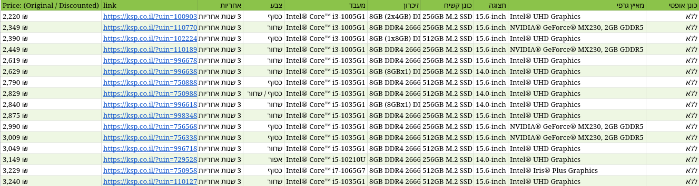

#LaptopWebScraper
Scrapes ksp.co.il for laptop specifications, and outputs a csv file.

This script uses:
* Asynchronous code to await the http requests
* Multiprocessing to parse the HTML pages concurrently
and thus scales with the number of cores available.

Example output:

